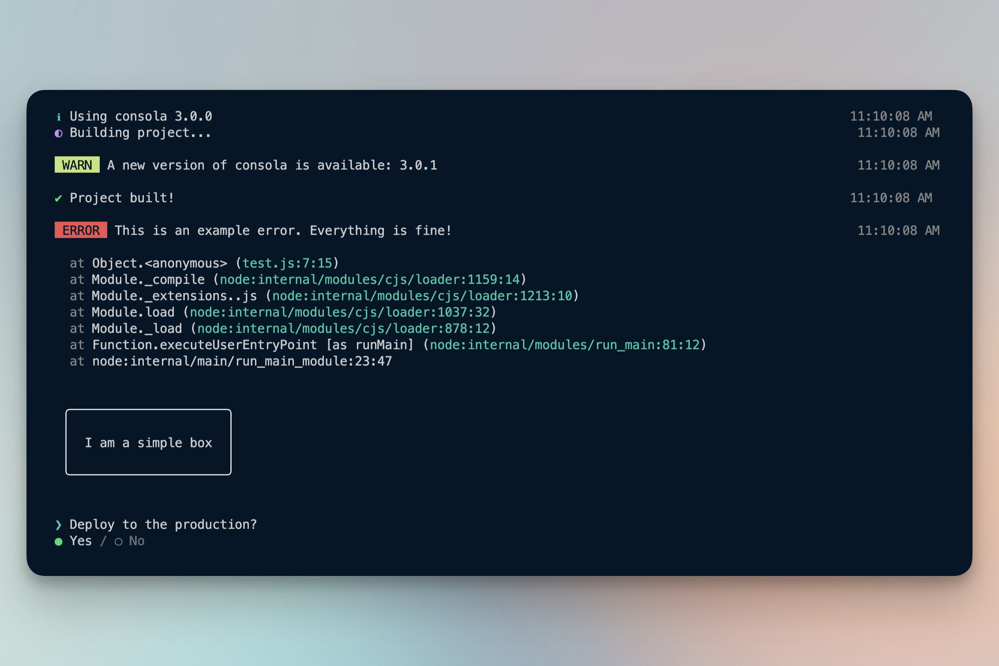
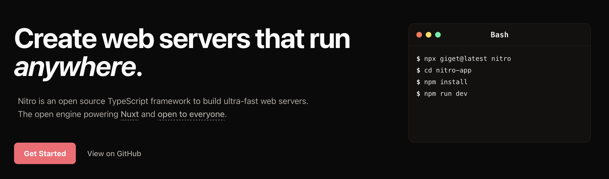
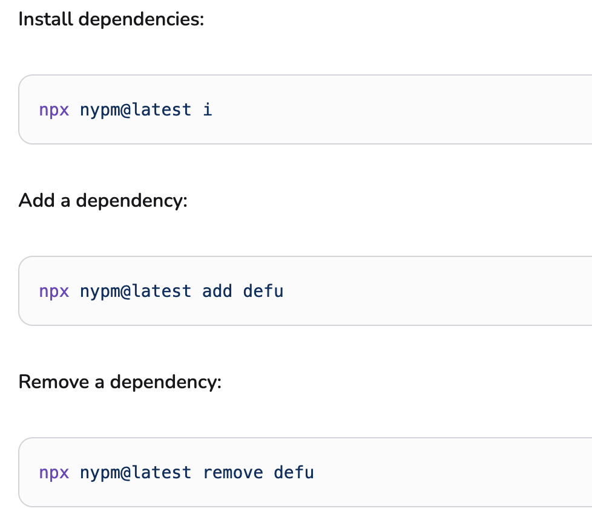

# UnJS: JavaScript unifié


---

## UnJS créé par les auteurs de Nuxt

Dirigé par [Pooya Parsa ](https://github.com/pi0).

Initialement, des briques unitaires pour Nuxt 3.

Maintenant, pour tout le monde de manière ouverte et efficace.

À ce jour, Nuxt et Analog (meta-framework Angular) l'utilisent.

---
layout: iframe
url: https://unjs-relations.barbapapazes.dev/
---

---
layout: fact
---

# Focus sur<br> quelques modules

<div absolute bottom-0 flex flex-wrap gap-8 mt-30 text-10>
  <span> unplugin</span>
  <span> consola /  citty</span>
  <span> h3 /  nitro</span>
  <span> nypm</span>
  <span> unpdf /  ipx</span>
</div>
---

##  unplugin

Pour les créateurs de plugin pour les outils, c'est la solution pour les rendre accessibles à la fois sous Webpack, Vite, Rollup, Rspack, etc..

<v-click>

```ts
import { createUnplugin } from 'unplugin'

export const unplugin = createUnplugin((options: UserOptions) => {
  return {
    name: 'unplugin-prefixed-name',
    transformInclude(id) {
      return id.endsWith('.vue')
    },
    transform(code) {
      return code.replace(/<template>/, '<template><div>Injected</div>')
    },
  }
})

export const vitePlugin = unplugin.vite
export const rollupPlugin = unplugin.rollup
export const webpackPlugin = unplugin.webpack
export const rspackPlugin = unplugin.rspack
export const esbuildPlugin = unplugin.esbuild
```

</v-click>
---

##  consola /  citty

Pour des CLI aux petits oignons.



---

##  h3 /  nitro

Créer un serveur backend avec des performances et un typage amélioré.

h3  propose une alternative à Express avec des performances accrues et des compétences en plus tout en assurant la compatibilité avec Express.

Nitro  est un réel framework combinant plusieurs briques UnJS dont h3, une gestion de stockage et de cache, un routage basé sur la structure des dossiers et surtout, un déploiment possible sur toutes les plateformes et environnement.



---

##  nypm

Pour ne plus vous embêter à choisir entre npm, pnpm, yarn, bun.. il vous choisit le bon selon la présence des fichiers de lock.



De plus, permet de vérifier la présence et d'installer des dépendances à la volée.

```ts
import {
  detectPackageManager,
  ensureDependencyInstalled,
  installDependencies,
  addDependency,
  removeDependency,
} from "nypm";

```
---

##  unpdf /  ipx

PDF et images à porter demain pour les manipuler avec simplicité.

unpdf  propose les fonctionnalités de PDF.js avec quelques foncitons en plus dont l'extraction de texte.

ipx  optimise vos images et permet d'utiliser des services d'images plus efficacement.

```ts {all|10-13}
import { listen } from "listhen";
import { createApp, toNodeListener } from "h3";
import {
  createIPX,
  ipxFSStorage,
  ipxHttpStorage,
  createIPXH3Handler,
} from "ipx";

const ipx = createIPX({
  storage: ipxFSStorage({ dir: "./public" }),
  httpStorage: ipxHttpStorage({ domains: ["picsum.photos"] }),
});

const app = createApp().use("/", createIPXH3Handler(ipx));

listen(toNodeListener(app));
```

---

- scule: utilitaire pour les strings
- serve-placeholder: Toujours servir même quand y a rien à servir (SEO friendly)
- uqr: Générer un QR code programmatiquement
- untun: alternative à ngrok passant par Cloudflare Quick Tunnels
- changelogen: Générer de beaux change logs sur ses commits
- get-port-please: Cherche un port disponible
- jiti: Exécuter du TypeScript avec Node.js
- pathe: Normaliser l'utilisation de `path`
- uncrypto: Utilitaire crypto
- ufo: Rendre les URL developer friendly
- unimport: Outils pour rendre l'auto-import facile
- et tant d'autres..

---
layout: iframe
url: https://unjs-relations.barbapapazes.dev/
---